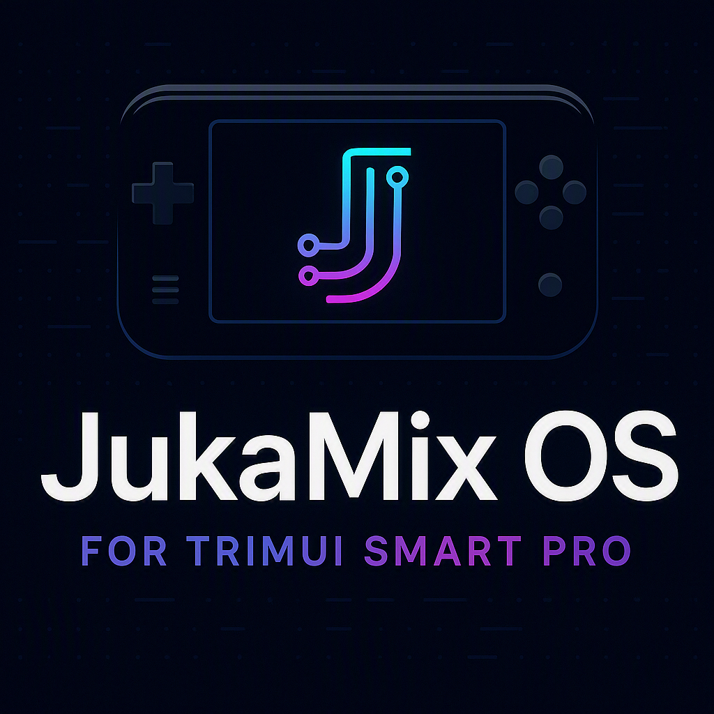

<div align="center">



### One OS for every TrimUI handheld.

Smart Pro · Smart Pro S · Brick · Brick Pro — auto-detected, auto-tuned.

[](https://github.com/jukaLang/JukaMix-OS/releases/latest)
[](https://github.com/jukaLang/JukaMix-OS/releases)
[](LICENSE)
[](https://discord.gg/R9qgJjh5jG)
[](https://www.patreon.com/c/JukaLang)
[](https://github.com/jukaLang/JukaMix-OS/stargazers)

**[⬇️ Download](https://github.com/jukaLang/JukaMix-OS/releases/latest)** ·
**[📖 Docs](https://github.com/jukaLang/JukaMix-OS/wiki)** ·
**[💬 Discord](https://discord.gg/R9qgJjh5jG)** ·
**[🎨 Themes](Themes/)**

</div>

---

## Why JukaMix?

JukaMix OS delivers a powerful, customizable experience — with improved settings, new features,
updated emulators, and additional apps. It's completely free and open source.

| | JukaMix OS |
|---|---|
| **Every TrimUI handheld** | Smart Pro, Smart Pro S and Brick from one image — performance profiles, emulator tuning and PortMaster setup adapt automatically to the running device |
| **Transactional updates with rollback** | Updates are journaled with automatic rollback on failure — designed to minimize update risks, though power loss or SD corruption can still cause issues |
| **Protected user data** | ROMs, BIOS, saves, states, screenshots and themes are on protected paths — the updater refuses to modify them |
| **No computer needed** | Wi-Fi → Control Center → System Update. A background checker toasts you when a release lands |
| **Integrity-checked updates** | Every file in an update is verified against the release manifest before it's applied |
| **Self-healing PortMaster** | Missing, broken, or copied without exec bits? It repairs itself on launch |
| **Built for creators** | Themes, icon packs, backgrounds, "Best" templates and automatic overlays |
| **Python & Go support** | Run Python scripts and compile Go programs directly on device |

---

## Development Tools

JukaMix OS includes built-in development tools for scripting and programming:

### Python Support
- **Python 3.11** runtime for running `.py` scripts
- **pip** package manager for installing libraries
- **Apps/PythonRunner** — Easy script execution and interactive shell

### Go Compiler
- **Go 1.22** toolchain for building `.go` programs
- **go build/run/get** — Full development workflow
- **Apps/GoCompiler** — Build, run, and manage Go projects

### Buildroot Environment
- **Full Linux chroot** with modern glibc 2.44
- **GPU/Audio/Input passthrough** for advanced development
- **OverlayFS** for persistent package installs

---

## JukaMix vs other CFWs

On the Smart Pro / Smart Pro S / Brick you have a handful of custom-firmware options. They
split into three philosophies (the last one on different hardware):

- **Keep the stock firmware** — JukaMix and (historically) Tomato run as a layer on
  top of the TrimUI firmware, so you keep its drivers, hardware video decode and power
  management. Everything is on the SD card: remove it and the device is stock again.
- **Replace the OS** — Knulli and MinUI boot their own system. You gain
  control and polish, but trade away the stock firmware's device-specific tuning.


| CFW | Devices | Base | Updates | Standout | Watch out |
|---|---|---|---|---|---|
| **JukaMix OS** | Smart Pro, Smart Pro S, Brick, Brick Pro | Stock firmware | Transactional, in-app over Wi-Fi | One image tuned for all four devices; transactional updates with rollback | Younger project; TrimUI devices only |
| **Knulli** | Broad — many handhelds | Batocera / EmulationStation, standalone OS | Full-image reflash | Desktop-grade emulation: scrapers, themes, Bluetooth, netplay | Heavier and slower to boot; higher idle power draw |
| **Tomato OS** | Original TrimUI Smart only | Stock firmware | Full-image | Pioneering enhanced OS (70+ emulators, ports) for its day | Discontinued; not for the Smart Pro / Smart Pro S / Brick |
| **MinUI** | Many devices — TrimUI builds are **Legacy** | Minimal libretro launcher | Full-image | Zero-config: boots straight to games, auto-resume | No settings, boxart or themes by default; TrimUI builds being retired |

### JukaMix OS

**Advantages** — runs on the stock TrimUI firmware (its drivers, hardware video decode and
sleep behavior stay intact); one image covers the Smart Pro, Smart Pro S and Brick with
per-device CPU/game profiles applied automatically; transactional updates that back up,
journal and roll back; the updater refuses to touch `Roms/`, `BIOS/`, saves or themes;
self-healing PortMaster, Python, glibc and the Wi-Fi Control Center; GPL-3.0 open source.

**Disadvantages** — TrimUI devices only; it's a layer on the stock firmware, so it inherits
stock quirks (and a TrimUI firmware update can change behavior underneath it); younger and
smaller community than Knulli.

### Knulli

**Advantages** — a true standalone OS (Batocera base) with EmulationStation's whole world:
automatic scraping, thousands of themes, Bluetooth controllers, netplay, per-system config;
one setup carries across many handhelds, not just TrimUI.

**Disadvantages** — much heavier: slower boot and higher power draw than the stock-based
options; full-image reflash to update; on TrimUI devices the hardware acceleration and
sleep/power behaviour historically lag the stock firmware's.

### Tomato OS

**Advantages** — in its time (2022–2023) a pioneering enhanced OS for the original TrimUI
Smart, with 70+ built-in emulators, ports and customization.

**Disadvantages** — built for the original TrimUI Smart only and no longer maintained; it
does **not** run on the Smart Pro, Smart Pro S or Brick. Listed here mainly so you don't
install it by mistake.

### MinUI

**Advantages** — the definition of simple: no settings, no boxart, no themes, no cruft; boots
fast, sips battery, auto-sleeps, and resumes exactly where you left off; the same card works
across many different handhelds.

**Disadvantages** — by design it has none of the comforts (scraping, artwork, PortMaster,
Wi-Fi apps) and no tuning; and on TrimUI specifically the Smart Pro and Brick builds are
marked **Legacy** — the project says they "will be retired in a future update", so it's a
risky pick for a daily driver.

> The short version: want the stock experience with safe updates across all four devices?
> That's JukaMix. Want a completely different, feature-dense OS? Knulli. Want
> bare-bones speed? MinUI.

---

## Install

> First time on JukaMix? Start here. Already running it? Skip to [Updating](#updating).
>
> **📖 Full installation guide:** See [docs/INSTALLATION.md](docs/INSTALLATION.md) for detailed
> instructions including rootfs setup, package system (.ipk), and troubleshooting.

### What you need

| Item | Requirement |
|------|-------------|
| **microSD card** | FAT32, 32 GB or larger recommended (holds OS + ROMs) |
| **Card reader** | Any USB or built-in reader works |
| **Computer** | Windows, macOS, or Linux — any will do |
| **TrimUI device** | Smart Pro, Smart Pro S, Brick, or Brick Pro |

> **One image works on all four devices** — there is no per-device download.

---

### Step 1 — Format the card

Format the card as **FAT32**, single partition.

<details>
<summary><b>Windows</b></summary>

1. Right-click the card → **Format**
2. Set **File system** to **FAT32**
3. Click **Start**

> **Cards over 32 GB?** The built-in formatter may only offer exFAT/NTFS.
> Use [Rufus](https://rufus.ie), [guiformat](https://www.ridgecrop.demon.co.uk/guiformat.htm),
> or the Raspberry Pi Imager instead.

</details>

<details>
<summary><b>macOS</b></summary>

1. Open **Disk Utility**
2. Select the card in the sidebar
3. Click **Erase**
4. Set **Format** to **MS-DOS (FAT32)**
5. Click **Erase**

</details>

<details>
<summary><b>Linux</b></summary>

```bash
# Identify the card (e.g. /dev/sdb)
lsblk

# Format as FAT32 (REPLACES ALL DATA!)
sudo mkfs.vfat -F 32 /dev/sdX1
```

</details>

---

### Step 2 — Download

👉 **[Download latest release](https://github.com/jukaLang/JukaMix-OS/releases/latest)**

Grab the `JukaMix_<stamp>.zip` file (e.g. `JukaMix_0821202601.zip`).

> The stamp is the build date+hour: `MMDDYYYYHH`
> So `0821202601` = August 21, 2026 at 01:00

---

### Step 3 — Extract to the card root

Extract the archive to the **root** of the SD card — **not into a subfolder**.

✅ **Correct** — You should see this at the card root:
```
SD Card/
├── Apps/
├── Emus/
├── Roms/
├── System/
└── trimui/
```

❌ **Wrong** — These mean you extracted incorrectly:
```
SD Card/
└── JukaMix_0821202601/    ← DO NOT extract to a subfolder
    ├── Apps/
    └── ...
```

<details>
<summary><b>Extraction tips by OS</b></summary>

| OS | Tool | Notes |
|----|------|-------|
| **Windows** | [7-Zip](https://www.7-zip.org/) | Right-click → Extract Here (preserves permissions) |
| **Windows** | WinRAR | Drag contents directly to SD card |
| **macOS** | Built-in | Double-click zip, drag contents to card |
| **Linux** | `unzip` | `unzip JukaMix_*.zip -d /path/to/sdcard` |

</details>

---

### Step 4 — First boot

1. **Safely eject** the SD card from your computer
2. **Insert** the card into your TrimUI device
3. **Power on** — first boot takes 2-5 minutes while the system initializes

> **What to expect:** The screen may go black briefly, show a JukaMix logo, then load the menu.
> This is normal on first boot.

<details>
<summary><b>🔧 Firmware update wizard (if prompted)</b></summary>

If your TrimUI firmware is older than JukaMix requires, a firmware wizard runs automatically:

1. **Press A** when prompted to start the update
2. **Do NOT remove the card** or turn off the device
3. **Wait** for the device to power off automatically
4. **Power back on** — the firmware will be flashed

> This only happens once. See `trimui/firmwares/MinFwVersion.txt` for the required version.

</details>

<details>
<summary><b>🔧 Stock launcher appears instead of JukaMix?</b></summary>

This usually means the SD card isn't set as the boot source:

- **Smart Pro:** Go to **Settings → Boot Source → SD Card**
- **Smart Pro S:** Go to **Settings → Boot Source → SD Card**
- **Brick/Brick Pro:** Boots from SD automatically (no setting needed)

If the option doesn't appear, try reformatting the card and re-extracting the archive.

</details>

<details>
<summary><b>🔧 Screen flickering or menu crashes?</b></summary>

If you see flickering or the menu crashes:

1. Power off the device (hold power button for 5 seconds)
2. Remove the SD card
3. On a computer, delete `System/usr/trimui/jukamix-version.txt` from the card
4. Reinsert the card and power on — JukaMix will re-initialize

If this persists, re-extract the archive to the card.

</details>

---

### Step 5 — Add your content

Drop your ROMs and BIOS files into the correct folders:

| Content | Where | Example |
|---------|-------|---------|
| **ROMs** | `Roms/<SYSTEM>/` | `Roms/GBA/zelda.gba` |
| **BIOS** | `BIOS/` | `BIOS/scph1001.bin` |
| **Themes** | `Themes/` | `Themes/MyTheme.7z` |
| **Icon packs** | `Icons/` | `Icons/MyIcons/` |
| **Wallpapers** | `Backgrounds/` | `Backgrounds/GBA/wallpaper.png` |

**Supported systems include:**
`GB`, `GBA`, `GBC`, `NES`, `SNES`, `Genesis`, `PS1`, `N64`, `PSP`, `NDS`, `DC`, `MAME`, `Arcade`, `Neo Geo`, and [many more](Emus/).

> **BIOS help:** Each emulator may require specific BIOS files. Check `Emus/<platform>/` for
> BIOS requirements — look for files named `*.bin` or `*.rom` in the folder.

> **Themes are drop-in:** Just drop `.7z` theme files into `Themes/`. They appear in the
> theme selector automatically.

---

### Quick check ✅

After first boot, verify everything works:

- [ ] Menu loads and is responsive
- [ ] System shows correct device name in **System Info**
- [ ] At least one game launches
- [ ] Wi-Fi connects (for updates)

**All good?** You're ready! Head to [Updating](#updating) to learn about OTA updates.
**Issues?** See [Troubleshooting](#troubleshooting) or ask on [Discord](https://discord.gg/R9qgJjh5jG).


---

## Updating

Updating is one tap, no computer required:

1. Connect the handheld to Wi-Fi.
2. Open **Apps → JukaMix Control Center → System Update** (or the standalone **System Update** app).
3. Confirm the download.

JukaMix resolves the latest GitHub release and — when the release ships a `manifest.txt` —
applies the change transactionally, verifying every file against the manifest as it's applied.
Every replaced file is backed up and journaled, pending config migrations (`migrations/*-to-*.sh`)
run once in order, and any failure rolls the update back automatically. Releases that ship only a
full image fall back to the classic full-image installer, which also migrates saves and settings.

<details>
<summary><b>Offline update (no Wi-Fi)</b></summary>

1. Download the latest `JukaMix_<stamp>.zip` from GitHub Releases on any computer.
2. Copy it to the **root** of the SD card.
3. Open **Apps → System Update** and apply it — or just reboot, and the legacy updater picks up
   the archive from the SD root.

</details>

---

## Supported devices

| Device | Code | SoC | GPU | Display | Notes |
|---|---|---|---|---|---|
| **TrimUI Smart Pro** | `tsp` | Allwinner A133 Plus | Mali-G31 | 1280×720 (16:9) | Flagship target, dual analog |
| **TrimUI Smart Pro S** | `tg5050` | Allwinner A523 | Mali-G57 | 1280×720 (16:9) | Fastest of the three, dual analog |
| **TrimUI Brick** | `brick` | Allwinner A133 Plus | Mali-G31 | 1024×768 (4:3, touch) | No analog sticks, no rumble |
| **TrimUI Brick Pro** | `brick_pro` | Allwinner A133 Plus | Mali-G31 | 1280×720 (16:9) | Same as Smart Pro, dual analog |

Every emulator launcher tunes the CPU to its device's own ceiling via
`cpufreq.sh ondemand 2 "${JUKAMIX_CPUFREQ_MAX:-6}"`: **Smart Pro S** runs at up to
2.0 GHz, **Smart Pro** and **Brick Pro** at 1.8 GHz and **Brick** at 1.6 GHz (the `[recommended_defaults]` of each
`Profiles/DEVICE-OVERRIDES/*_base.cfg`). Launchers written for the faster A523 are clamped to the
closest valid frequency on the A133 instead of being rejected, so the same image tunes every
device correctly.

**Per-game profiles** in `Profiles/<system>/` (e.g. `Profiles/DC/SonicAdventure.cfg`) apply
automatically when that game launches. The applier (`apply_game_profile.sh`) clamps each
profile's frequencies to the running device's ladder, so a profile tuned on the Smart Pro S
applies safely on the Smart Pro and Brick too — a profile verified for another device warns, and
`--strict` refuses it.

---

## PortMaster, made simple

PortMaster ships pre-installed in **Apps → PortMaster**, with a second entry in the **PORTS** tab.
Both entry points self-heal: if PortMaster is missing, broken, or was copied onto the SD card
without execute permissions, it is repaired automatically on launch. Ports live in `Data/ports/`
and appear in the PORTS tab automatically.

Drop any port zip into `Apps/PortMaster/PortMaster/autoinstall/` and open the PortMaster app —
it installs them for you.

<details>
<summary><b>The <code>jm-portmaster</code> CLI</b></summary>

From the terminal or over SSH:

```bash
jm-portmaster status    # what is installed, where, and how healthy
jm-portmaster install   # download + install the latest official release
jm-portmaster ensure    # install only if missing/broken (no-op when healthy)
jm-portmaster fix       # repair exec bits, Data/ports, launcher (offline)
jm-portmaster launch    # ensure, then open the PortMaster GUI
```

Downloads are checksum-verified against PortMaster's published MD5.

**Offline install:** grab `trimui.portmaster.zip` from the PortMaster-GUI releases page, copy it
to the SD card, then run:

```bash
jm-portmaster install --from-zip /mnt/SDCARD/trimui.portmaster.zip
```

</details>

---

## Built-in tools

Python 3.11 ships in the image (`System/bin/python3.11` with Pillow and pip), and
several utilities are built on top of it. Find them under **Apps → System Tools → TOOLS**:

| Tool | What it does |
|---|---|
| **Find Duplicate Roms** | Hashes every ROM per system (size + md5) and stashes exact duplicates into `Data/duplicates/<system>/`. Files are moved, never deleted. |
| **Test ROM Archives** | Checksum-tests every `.zip` per system and stashes broken archives into `Data/archives-corrupt/<system>/`. Also moved, never deleted. |
| **Optimize Boxart Images** | Shrinks boxart in `Imgs/` down to 512 px with Pillow and re-saves optimized; only overwrites when the result is smaller. |
| **M3U Playlist Generator** | Creates multi-disc playlists from `(Disc 1)`/`[Disc 2]`-style files in `Roms/`. |

Add your own Python tools the same way: a script in `System/usr/trimui/scripts/` plus a launcher
in `Apps/SystemTools/Menu/TOOLS/` that calls `python3.11` (see the existing entries for the
`LD_LIBRARY_PATH`/`PATH` setup and the `TOTAL_*=` output convention the UI parses).

**Recent-glibc software:** the image bundles glibc **2.44** in `System/lib/glibc/` (loader + core
libs), so anything built against a newer glibc than the firmware ships still runs. Use the
`jm-glibc` wrapper — `jm-glibc /path/to/binary [args…]` — which invokes the bundled loader
directly; update the runtime from the Debian `libc6` package (see `System/lib/glibc/README.md`).

---

## Customise it

JukaMix is built for creators. Everything below is drop-in — no rebuild required.

| Folder | What goes there |
|---|---|
| `Themes/` | Full UI themes |
| `Icons/` | Icon packs |
| `Backgrounds/` | Wallpapers per system |
| `Best/` | Curated game-collection templates |

Made something good? Open a PR — community themes and icon packs are very welcome.
See [CONTRIBUTING.md](CONTRIBUTING.md) for the format spec and submission process.

Best pack folders must not contain spaces — the on-device name comes from the pack's
`config.json` `label`, not the folder name (see `Best/FreeGamesCollection/`).

---

## Troubleshooting

| Problem | Quick Fix |
|---------|-----------|
| **Stock launcher appears** | Settings → Boot Source → SD Card (Brick: automatic) |
| **Screen flickering** | Delete `System/usr/trimui/jukamix-version.txt`, reboot |
| **Games not showing** | Check ROMs are in `Roms/<SYSTEM>/` with correct extension |
| **No sound** | Check volume buttons, Settings → Sound |
| **Wi-Fi won't connect** | Toggle Wi-Fi, reboot, check 2.4GHz network |
| **Slow performance** | Use Performance Profiles, check game compatibility |
| **Device won't boot** | Remove SD card → reformat FAT32 → re-extract archive |

> **📖 Full troubleshooting guide:** See [docs/TROUBLESHOOTING.md](docs/TROUBLESHOOTING.md)
> for detailed solutions to common issues.

---

## Repository layout

A few boundaries are worth knowing before you poke around:

| Path | What it is |
|---|---|
| `System/bin/`, `System/lib/` | Prebuilt runtime payload shipped in the image: third-party binaries (`bash`, `curl`, `7zz`, `ffmpeg`, …) and shared libraries, installed at `/mnt/SDCARD/System/bin` and `/mnt/SDCARD/System/lib`. `System/bin` is on `PATH` on-device. |
| `bin/`, `lib/`, `migrations/`, `config/` | JukaMix's own tooling (`jm-update`, `jm-opkg`, `jm-portmaster`, …). `install.sh` copies these into `System/usr/jukamix/{bin,lib,migrations}` on the device. `/mnt/SDCARD/bin` is added to `PATH` (after `System/bin`, so nothing is shadowed) — `jm-opkg`, `jm-doctor`, etc. are invocable directly. |
| `scripts/`, `tests/`, `schemas/`, `packages/` | Host-side build and validation tooling, **excluded from the release image and the OTA manifest**. Never needed on the SD card. |
| `tools/` | Build tooling that **also ships** in the image — JukaHub, System Update and `jukamix-validate` read `/mnt/SDCARD/tools/` on-device. |
| `Roms/`, `BIOS/`, `Saves/`, `States/`, `Pictures/screenshots/`, `Themes/` | Protected user-data paths — an update never modifies them. The repo tracks only scaffolding (`.gitkeep`) and OS-provided content such as emulator bezels or machine definitions; user files never belong in git. |
| `MANIFEST.json` | Release build artifact, generated into `dist/` by `scripts/build_release.sh`. Never committed, never part of the image. |
| `trimui/firmwares/` | TrimUI firmware blobs are fetched on demand (see `scripts/fetch_firmware.sh`), not tracked in git. |
| `RetroArch/.retroarch/cores/cores.7z` | Compressed RetroArch cores archive (~335MB, 165 cores). Too large for git; hosted at [jukaLang/Packages](https://github.com/jukaLang/Packages/releases/tag/cores) and downloaded at build time via `scripts/fetch_cores.sh`. Never committed to git. |

---

## Contributing

Issues and pull requests are welcome — see [CONTRIBUTING.md](CONTRIBUTING.md) to get started,
and [SUPPORT.md](SUPPORT.md) if you need help rather than want to file a bug.
Join the conversation on [Discord](https://discord.gg/R9qgJjh5jG).

<details>
<summary><b>Release pipeline (maintainers)</b></summary>

```bash
scripts/build_release.sh            # defaults to today's date+hour stamp
scripts/build_release.sh 0820202614  # or pass an explicit stamp
```

Stamps the build, fetches the firmware blobs, restores exec bits, and publishes into `dist/`:

| Asset | Purpose |
|---|---|
| `JukaMix_0820202614.zip` | The full SD-card image (stamp = `MMDDYYYYHH`) |
| `manifest.txt` | Incremental OTA manifest. **This is the transactional updater's source of truth**: when a release ships it, updates apply incrementally; without it, updates fall back to the full-image installer. `manifest.json` is accepted as a fallback by the updater, but `manifest.txt` always wins. |

Before archiving it runs `scripts/validate_devices.sh` to confirm the combined image ships the
device-specific files, profiles, and detection data for every supported device — Smart Pro
(`tsp`), Smart Pro S (`tg5050`) and Brick (`brick`) — and that each one resolves to the right
hardware profile and capabilities.

Publishing is automatic: every push to `main` (or a manual run of the [release workflow](.github/workflows/JukaMix-OS%20Release.yml))
builds the image and **publishes** the release with the archive and manifest. The stamp is
generated at build time from the date+hour (`MMDDYYYYHH`, e.g. `JukaMix_0820202614`), so every
build is a new version. Rebuilding within the same hour overwrites that hour's release, so
`releases/latest` always points at the newest build; on-device update checkers simply report no
update until the first release exists.

</details>

---

## Attribution

JukaMix OS includes work from **PortMaster** (Kloptops), **Schmurtzm's** scripts, and many
community contributors. All included third-party components remain subject to their respective
licenses and copyrights.

Licensed under [GPL-3.0](LICENSE).

<div align="center">
<sub>Made by the Juka project · <a href="https://discord.gg/R9qgJjh5jG">Discord</a> · <a href="https://github.com/jukaLang">GitHub</a></sub>
</div>
